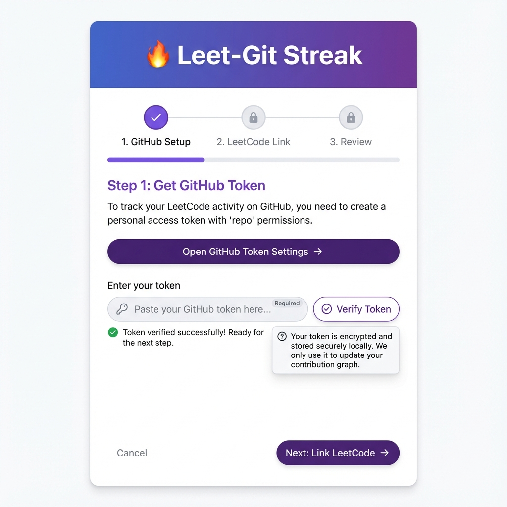
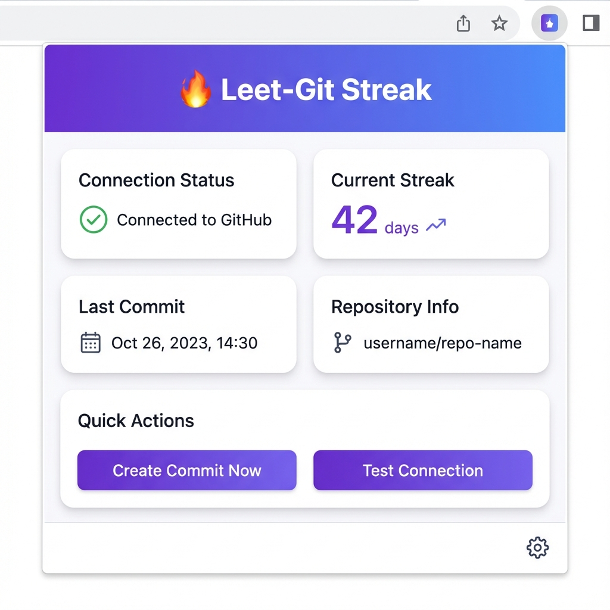

# 🔥 Leet-Git Streak

[](https://github.com/anubhavaanand/Leet-git-streak/stargazers)
[](https://opensource.org/licenses/MIT)
[](https://github.com/anubhavaanand/Leet-git-streak)
[](https://github.com/anubhavaanand/Leet-git-streak)

A browser extension that automatically transfers your LeetCode streaks into GitHub streaks effortlessly. Never lose your GitHub contribution streak again!

## 📸 Screenshots

<div align="center">
  
  
  <p><em>Easy 3-step setup wizard and intuitive dashboard</em></p>
</div>

## ✨ Features

- 🎯 **3-Step Setup Wizard**: Super easy installation with guided setup (similar to POCO!)
- 🔍 **Automatic Detection**: Monitors your LeetCode activity and detects when you solve problems
- 🔄 **Auto-Sync**: Automatically creates GitHub commits when you solve LeetCode problems
- 🔑 **Token Verification**: Real-time GitHub token validation with auto username detection
- 📦 **Auto Repository Creation**: Creates GitHub repository automatically if it doesn't exist
- 📊 **Status Tracking**: View your current streak and last commit status
- 🎯 **Manual Control**: Create commits manually or test your connection anytime
- 💫 **Smart Defaults**: Pre-filled values for quick setup

## 🚀 Quick Setup (3 Easy Steps!)

### Step 1: Install the Extension

#### For Brave/Chrome/Edge (Chromium-based browsers)

1. **Clone or Download this repository**
   ```bash
   git clone https://github.com/anubhavaanand/Leet-git-streak.git
   cd Leet-git-streak
   ```

2. **Load the extension in your browser**
   - Open **Brave/Chrome/Edge** and go to:
     - Brave: `brave://extensions/`
     - Chrome: `chrome://extensions/`
     - Edge: `edge://extensions/`
   - Enable **"Developer mode"** (toggle in the top right)
   - Click **"Load unpacked"**
   - Select the `Leet-git-streak` folder
   - The extension icon should appear in your toolbar! 🔥

> **Note:** Icons are already included in the repository, so no need to create them manually!

### Step 2: Run the Setup Wizard

1. **Click the extension icon** in your browser toolbar
2. You'll see a **3-step setup wizard** that guides you through:
   
   **Step 1: Get GitHub Token**
   - Click the **"Open GitHub Token Settings"** button
   - Click **"Generate new token (classic)"**
   - Check the **`repo`** checkbox
   - Click **"Generate token"** and copy it
   - Paste the token in the wizard and click **"Verify Token"**
   - Your GitHub username will be auto-detected! ✨
   
   **Step 2: Repository Setup**
   - Your username is already filled in
   - Enter a repository name (default: `leetcode-streak`)
   - The extension will create the repository automatically if it doesn't exist!
   
   **Step 3: Final Configuration**
   - Branch and file path are pre-filled with smart defaults
   - Click **"Finish Setup"** and you're done! 🎉

### Step 3: Start Using!

That's it! The extension is now configured and will:
- ✅ Automatically detect your LeetCode activity
- ✅ Create GitHub commits daily to maintain your streak
- ✅ Track everything in a markdown file in your repository

## 📋 Manual Setup (Alternative)

If you prefer to set up manually instead of using the wizard:

### 1. Create a GitHub Personal Access Token

1. Go to [GitHub Settings > Developer settings > Personal access tokens](https://github.com/settings/tokens)
2. Click **"Generate new token (classic)"**
3. Give it a name: `Leet-Git Streak`
4. Select the **`repo`** scope (full control of private repositories)
5. Click **"Generate token"**
6. **Copy the token immediately** (you won't see it again!)

### 2. Create a GitHub Repository (Optional)

Create a new repository (or use an existing one):
- Repository name: `leetcode-streak` (or any name you prefer)
- Can be public or private
- The extension can create it automatically if you have the token!

### 3. Configure Manually

1. Click the extension icon
2. Click **"⚙️ Edit Settings"**
3. Fill in:
   - **GitHub Token**: Your personal access token
   - **Repository Owner**: Your GitHub username
   - **Repository Name**: Your repository name
   - **Branch**: Usually `main` or `master`
   - **File Path**: `leetcode-streak.md` (or your preferred path)
4. Click **"Save Configuration"**
5. Click **"Test Connection"** to verify

## How It Works

1. **Detection**: When you visit LeetCode and solve problems, the extension detects your activity
2. **Daily Check**: The extension checks once per day if you've been active on LeetCode
3. **Auto-Commit**: If activity is detected and you haven't committed today, it automatically creates a GitHub commit
4. **Streak Maintenance**: The commit updates a markdown file in your repository, maintaining your GitHub contribution streak

## 💻 Usage

### Automatic Mode (Recommended)

1. Just use **LeetCode normally** - solve problems, check your profile, etc.
2. The extension **automatically detects activity** and creates commits
3. Check the extension popup to see status and last commit date
4. **One commit per day** to maintain your GitHub streak

### Manual Mode

1. Click the extension icon
2. Click **"🚀 Create Commit Now"** in the Quick Actions section
3. Useful if you want to commit outside of LeetCode activity

### Check Status

- Click the extension icon anytime
- View your **last commit date**
- See your **current LeetCode streak** (when on LeetCode)
- Check your **repository information**

## File Format

The extension creates/updates a markdown file in your repository with entries like:

```markdown
## 2024-01-15

- **Time**: 2024-01-15T10:30:00.000Z
- **Streak**: 42
- **Activity**: LeetCode problem solved

---

## 2024-01-14

- **Time**: 2024-01-14T09:15:00.000Z
- **Streak**: 41
- **Activity**: LeetCode problem solved

---
```

## Troubleshooting

### Extension not detecting LeetCode activity

- Make sure you're on `leetcode.com` domain
- Refresh the LeetCode page after installing the extension
- Check browser console for any errors (F12 > Console)

### GitHub commits not being created

- Verify your GitHub token has `repo` permissions
- Test the connection using the "Test Connection" button
- Check that the repository exists and you have write access
- Verify the branch name is correct (usually `main` or `master`)

### "Already committed today" message

- The extension only creates one commit per day to maintain your streak
- If you need multiple commits, you can manually trigger them or modify the extension code

## Privacy & Security

- Your GitHub token is stored locally in your browser's sync storage
- The extension only accesses:
  - LeetCode.com (to detect activity)
  - GitHub API (to create commits)
- No data is sent to any third-party servers
- All processing happens locally in your browser

## Permissions Explained

- **Storage**: To save your configuration and track commit dates
- **Active Tab**: To detect LeetCode activity on the current page
- **Scripting**: To inject content scripts on LeetCode pages
- **Host Permissions**: 
  - `leetcode.com/*`: To monitor LeetCode activity
  - `api.github.com/*`: To create GitHub commits

## Development

### Project Structure

```
Leet-git-streak/
├── manifest.json       # Extension manifest
├── background.js       # Service worker for GitHub API
├── content.js         # Content script for LeetCode detection
├── popup.html         # Extension popup UI
├── popup.css          # Popup styles
├── popup.js           # Popup logic
├── icons/             # Extension icons
│   ├── icon16.png
│   ├── icon48.png
│   └── icon128.png
├── package.json       # Project metadata
└── README.md          # This file
```

### Making Changes

1. Edit the relevant files
2. Go to `chrome://extensions/`
3. Click the refresh icon on the extension card
4. Test your changes

## License

MIT License - feel free to use and modify as needed!

## Contributing

Contributions are welcome! Feel free to open issues or submit pull requests.

## Disclaimer

This extension is for educational purposes. Use responsibly and in accordance with GitHub's Terms of Service. Maintaining streaks through automated commits is generally acceptable, but make sure you're actually solving problems on LeetCode!

---

**Happy Coding! 🔥**
